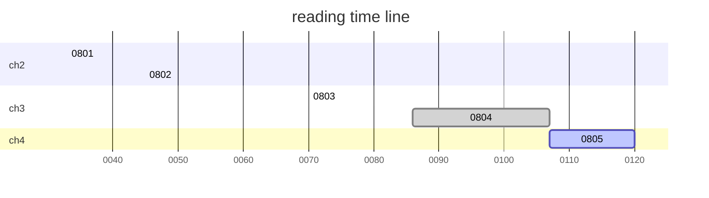
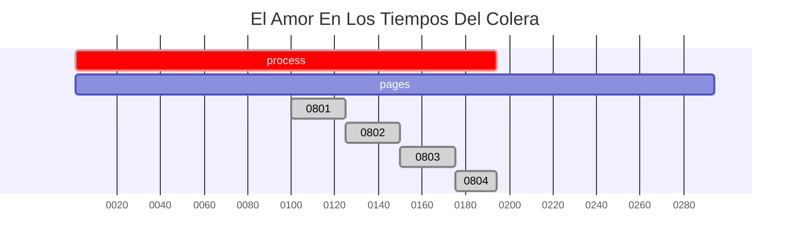
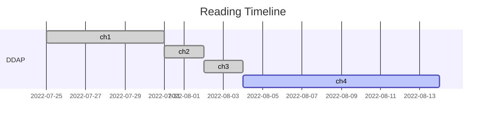
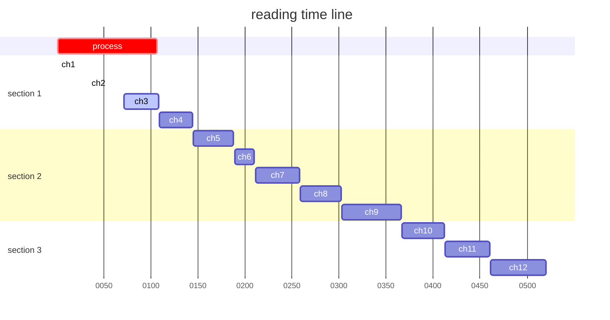

# Designing Data-intensive Applications
 数据密集型应用系统设计-读书笔记
 
| chapter |title| start | finish |process|
| :-----:| :----: | :----: |:----: |:----: |
|ch1|可靠、可扩展与可维护的应用系统|2022-07-25|2022-07-31|8.59%|
|ch2|数据模型与查询语言|2022-08-01|2022-08-02|13.17%|
|ch3|数据存储与检索|2022-08-03|2022-08-04|20.58%|
|ch4|数据编码与演化|2022-08-05|||

