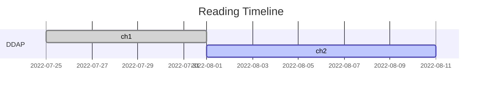

# Designing Data-intensive Applications
 数据密集型应用系统设计-读书笔记
 
| chapter |title| start | finish |
| :-----:| :----: | :----: |:----: |
|ch1|可靠、可扩展与可维护的应用系统|2022-07-25|2022-07-31|
|ch1|数据模型与查询语言|2022-08-01||
 

 
