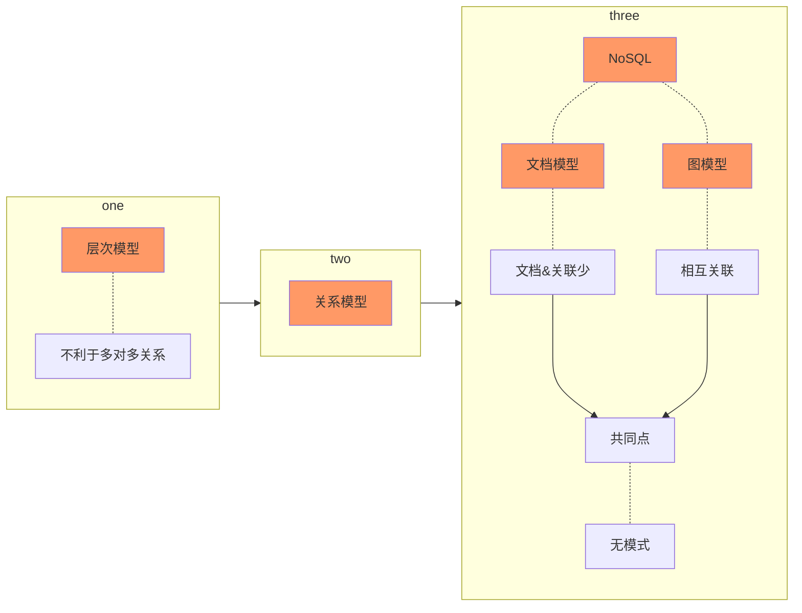

- # 第2章 数据模型与查询语言
  * 关系模型与文档模型
  	- 关系模型与文档模型
  		- ```最著名的模型- SQL```
  			- 关系数据库
  		- NoSQL的诞生
  		- 对象 -  关系不匹配
  		- 多对一与多对多的关系
  		- 文档数据库是否在重演历史?
  			- 网络模型
  			- 关系模型
  			- 文档数据库的比较
  		- 关系数据库与文档数据库现状
  			- 哪种数据模型的应用代码更简单?
  				- 取决于数据项之间的关系
  			- 文档模型中的模式灵活性
  			- 文挡数据库与关系数据库的融合
  - 数据查询语言
  	- Web上的声明式查询
  	- MapReduce查询
  - 图状数据模型
  	- 属性图
  	- Cypher查询语言
  	- SQL中的图查询
  	- 三元存储与 SPARQL
  		- 语义网
  		- RDF数据模型
  		- SPARQL查询语言
  	- Datalog基础





